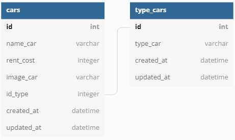

# Car-Management-Dashboard

Challenge Chapter 5 Binar Academy

# ERD

# Client

1. Halaman Index (GET) = http://localhost/
2. Halaman Create Car (POST) = http://localhost/create-car
3. Halaman Edit Car (GET) = http://localhost/edit-car/:id
4. Menampilkan Hasil Filter (GET) = http://localhost/:id
5. Menampilkan Hasil Search (POST) = http://localhost/search

# API

1. Create Car (POST) = http://localhost:8000/api/v1/Cars
2. Read All Cars (GET) = http://localhost:8000/api/v1/Cars
3. Read One Car (GET) = http://localhost:8000/api/v1/Cars/:id
4. Update Car (POST) = http://localhost:8000/api/v1/Cars/:id
5. Delele Car (GET) = http://localhost:8000//api/v1/deleteCars/:id
6. Filter Car (GET) = http://localhost:8000/api/v1/FilterCars/:id
7. Search Car (GET) = http://localhost:8000/api/v1/SearchCars/:search
